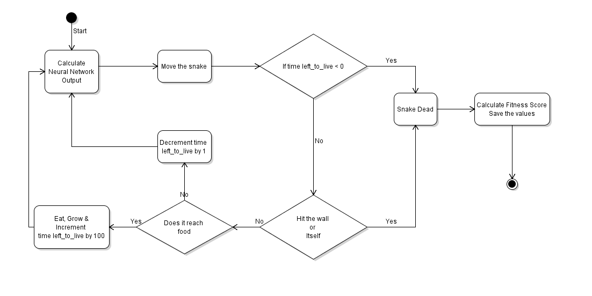

 **Activity UML Diagram:**

**Class UML Diagram:**

**AI Algorithm used:**

There are many methods, algorithms, and techniques that could be used to design a Snake. Some of these could fall under the umbrella term of AI. We will be focusing on a single method: _genetic random mutation of a neural network._

The main reason for using _genetic random mutation_ is because:

1. We don&#39;t have a dataset of high scoring Snake gameplays to use to train a neural network by example.
2. Personal interest in seeing if it&#39;s possible to evolve logic that can play Snake through only genetic mutations.

**What is** _ **genetic random mutation?** _

Instead of picking a type of neural network and then slowly training it based on available Snake gameplay datasets using different algorithms like Gradient Descent, MinMax, etc. we are going to create a scenario for one to evolve on its own.

All changes to the neural nets will be random — not through direct feedback of playing the game move-by-move. Overtime, small random changes to the neural networks should lead to a fully functioning AI as the top performers in each generation survive to breed the next.

In our program generation 1 will be generated randomly i.e. randomly generating the 3 weight functions for neural network (as it&#39;s a 3 layered neural network) for each of the population of that generation. The further generation will be generated with the help of the well known phenomenon of Natural Selection i.e the surviving snakes of previous generation with the help of **crossover** and **mutation**. For this we will sort all the snakes of previous generation with the help of a specific score we are calling as _ **fitness score** _ that takes lifetime and length of the snake into consideration.

After sorting, the _crossover_ is done with the help of 2 parents selected from the previous generation and breeding them with the help their individual fitness score the child is then further mutated slightly according to the pre-defined mutation rate. And the new generation of snakes is created and previous generation of snakes is replaced by them.

The above generated weight function is then used to get the output from the neural network which take various input with reference to the snake and the environment i.e.

1. Distance from the nearest wall
2. Distance from the food
3. Distance between head and the body

For each of the 8 possible directions i.e. 8\*3 = 24 inputs which is passed to the 2 hidden layers using the weight functions and then the final output layer which generates the possible direction snake should move (up, down, left, right).

The output is then analysed and used to move snake using a function called Move as the snake moves its life time is increased and Time it has left\_to\_live is decremented to avoid loops. The **condition of looping** can arise due to the fact that the neural network might give more weightage to the survival conditions and less to the goal of getting the food which might result in snake going round and round in circles, to avoid this we are deducting time left to live for every movement of snake if he didn&#39;t achieve the goal of getting the food. If he achieve his goal of getting the food he is rewarded for the same (i.e. a specific number of points is added to left\_to\_live).

_Below is the Activity UML diagram showing the running process of each snake._

